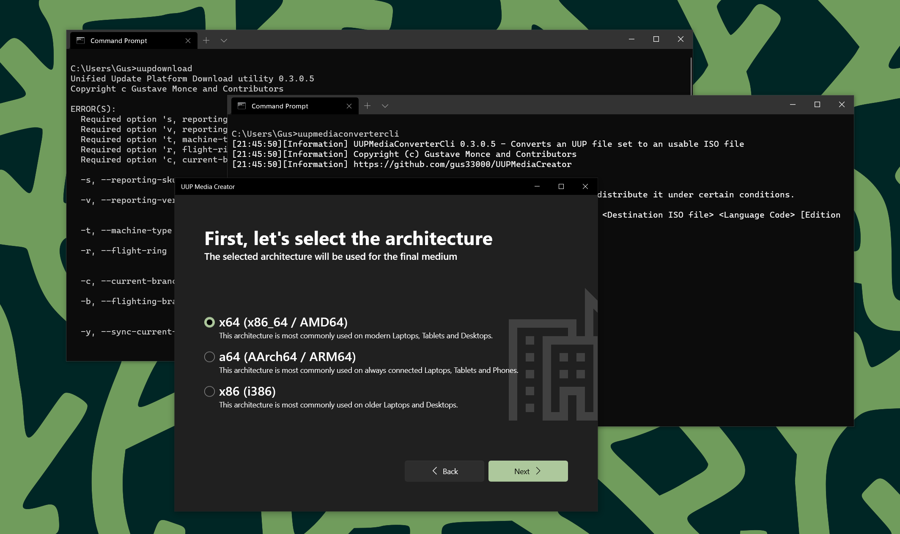

   
  <b>An utility to convert Unified Update Platform file sets into Windows Media files</b> 
  <a href="./src">Source Code</a> |
  <a href="./docs">Documentation</a> |
  <a href="./thirdparty">Third party libraries</a>
   
   
   

## Readme

UUP Media Creator is a set of tools designed to help you scan, fetch updates from Microsoft own Unified Update Platform (UUP), and allow you to create medium out of it when an appropriate tool does not exist in the wild.

Right now the tooling includes:

- UUPDownload: Allows you to scan, fetch and download updates from UUP (Windows Desktop, Windows 10X, Windows Holographic, Windows Server, Windows Mobile, Windows IoT etc...)
- UUPMediaConverterCli: Allows you to convert a downloaded UUP update for Windows Desktop into an usable ISO image to use in last decade DVD reader or simply mounted.
- An experimental UWP front end is also provided, but is not the main focus for now.

## Contributing

You are free to contribute to this project, in fact we would welcome any form of help. But please keep in mind the following points if you do:

- Please try to maintain your PR with a reasonable set of commits
- Please try to not change functionality not concerned by your PR
- Avoid changing the entire app, if you feel like this is needed, please file an issue so we can discuss about it between contributors.

## Bugs

This project, as with anything in Computer Science, is not bug free. If you find anything wrong, please file an issue in the issue tracker. Please include the tool version, as well as the Operating System you are running on your computer, and any other applicable details helpful to reproduce the issue.
